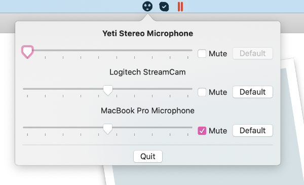

# sshh

## Description

This is my very first Swift project and it aims to be a small utility for controlling audio input level from the Macos Menu bar.
I am struggling using SwiftUI and Appkit without much preparation.    
I'd really appreciate your help in completing the app with a decent design and basic working functionality.

## Resources and inspiration

* https://github.com/yulrizka/osx-push-to-talk
* https://rogueamoeba.com/soundsource/
* https://mutify.app/
